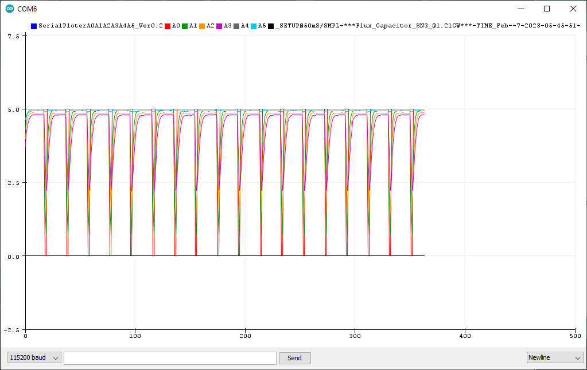

# SerialPloterA0A1A2A3A4A5
## Make an Arduino UNO into a six channel (A0 - A5) serial plotter.  
Measures in voltage (assumes the analog reference is 5.0 Volts).  
It is a good idea to add a series resistor (1K for example) to each Analog input and be careful not put voltages greater than 5V into the inputs. From the resistor add a wire to a test probe or clip lead.

Screen shot of serial plot
  

## Instructions
Use the Arduino IDE serial plotter but setting for 115200 BAUD.  
Open the plotter by pressing and holding <Ctrl> <Shift> and  pressing "L"  
Close and reopen the plotter to reset.

## Other
   File: SerialPloterA0A1A2A3A4A5.ino  
   By: Forrest Lee Erickson  
   Date: 20230206 Initial release.  
   About: Using the serial ploter feature of the Arduino IDE make traces like a strip chart or
   oscilliscope of the six analog inputs of an Arduino UNO.  
   Winks the BUILTIN LED to indicate activity.  

   License: This firmware is dedicated and released to the public domain.  
   Warranty: This firmware is designed to kill you and render the earth uninhabitible, however is not guarenteed to do so.

   Hardware: Run this on an Arduino UNO
